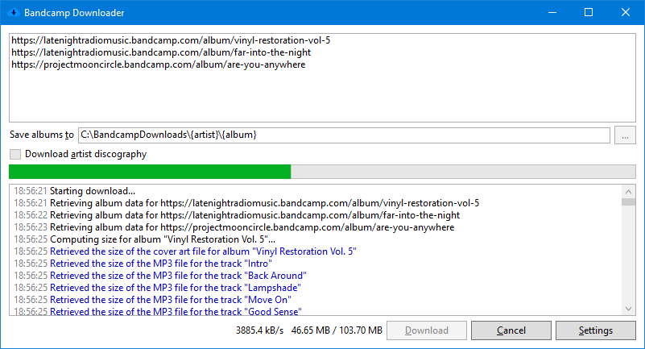

<h1 align="center"> Bandcamp Downloader</h1>

    

## Description

BandcampDownloader is a Windows application that helps downloading albums from [bandcamp.com](https://bandcamp.com) by retrieving the 128 kbps MP3 files streamed on the website. It aims to ease the life of those who prefer to listen to music on their favorite player rather than on their web browser, but offers only what is already freely available on Bandcamp.

## Features

* Download MP3 files from Bandcamp:
  * From album pages: `https://[artist].bandcamp.com/album/[album]`,
  * From track pages: `https://[artist].bandcamp.com/track/[track]`,
  * From artist pages: `https://[artist].bandcamp.com`.
* Add ID3 tags to tracks: Album, Artist, Album Artist, Title, Track number and Year.
* Save lyrics (if available) to ID3 tags.
* Download cover art and:
  * Convert it to jpg,
  * Resize it,
  * Save it in tracks tags and in folder.
* Create playlist file (supported formats are: m3u, pls, wpl, zpl).

    

## Release notes

See the [changelog](CHANGELOG.md).

## Contributing

If you wish to help translate the application, please read the [guidelines](/docs/help-translate.md).

## License

BandcampDownloader is licensed under the MIT license - see the [LICENSE](LICENSE) file for details.

## Credits

Some icons by [Yusuke Kamiyamane](http://p.yusukekamiyamane.com) licensed under a [Creative Commons Attribution 3.0 License](https://creativecommons.org/licenses/by/3.0).

The list of open-source libraries used by BandcampDownloader can be found [here](docs/dependencies.md).

## Piracy

You'll do what you want to do with this app, but remember to buy albums from your favorite artists if you want to support them!

And for the artists, Bandcamp [says](https://get.bandcamp.help/hc/en-us/articles/360007902173-I-heard-you-can-steal-music-on-Bandcamp-What-are-you-doing-about-this-) it all:
> **One of my fans showed me a totally easy way that someone could STEAL my music off of Bandcamp using RealPlayer 14.1 beta 3, or RipTheWeb.com, or by going into Temporary Internet Files and renaming blah blah blah. What are you doing about this grave problem?**
>
> Nothing. Since streams on Bandcamp are full-length, it’s true that someone could use one of the above methods to access the underlying MP3-128. And sure, we could throw some technical hurdles in their way, but if they hit one of those hurdles, it’s not like they’d slap their forehead and open their wallet. Instead, they’d just move on to some other site where those restrictions aren’t in place, and you’ll have squandered the chance to make your own site the premier destination for those seemingly cheap, but enthusiastic, word-spreading, and potentially later money-spending fans. In other words, the few people employing the above methods are better thought of as an opportunity, not a lost sale. If you’re still skeptical, [this may help](https://newmusicstrategies.com/but-if-they-steal-it/).
